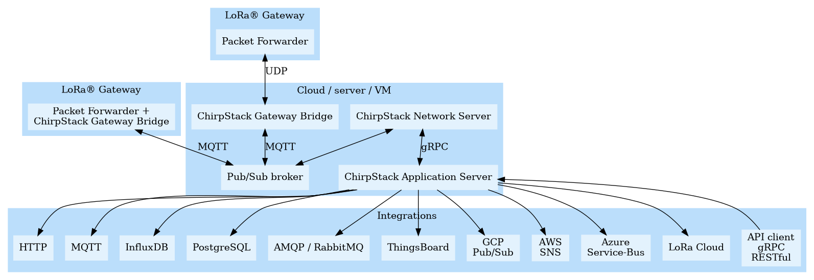

ChirpStack architecture and configuration options

ChirpStack (<https://www.chirpstack.io/>) is an open source software project that provides free software components to implement a LoRaWAN network. There are many ways to configure ChirpStack and this guide provides an overview of some of the options. Our project’s gateways are either a Raspberry Pi 3B+ or Raspberry Pi Zero gateway with Rak Wireless LoRa concentrators.

ChirpStack has three primary components:
 - Gateway Bridge: handles the communication with the LoRaWAN gateways
 - Network Server: Receives data from all of the gateways and performs de-duplication services
 - Application Server: Responsible for the device "inventory" part of a LoRaWAN infrastructure, handling of join-request and the handling and encryption of application payloads.

In addition to there three components there is also the Gateway concentrator software which controls the gateway router responsible for receiving the data from LoRaWAN nodes and sending it to a Gateway Bridge. The concentrator software must reside on the LoRaWAN gateway but all other components can be either on the gateway or on other servers. The ChirpStack project has it’s own concentrator called the Concentratord that works with the RAK Wireless Raspberry Pi gateways and many others as well. 

A good overview of the different components is at <https://www.chirpstack.io/project/architecture/>. This is a figure illustrating possible architectures:

When using a single Raspberry Pi IRPi) LoRa Gateway it is possible (but not required) to install all three components on the RPi and use the Application Server to send data to another server. If more than one LoRaWAN gateway is in  use then it is necessary to have all of the gateways sending data to a single Network Server so de-duplication can take place to so a data packet that was sent from a single node but received by multiple gateways can be sent to the application server. 

The ChirpStack project recommends installing the Gateway Bridge on the gateway but that isn’t always practical. One example configuration we have experimented with is to install all three ChirpStack components on a DigitalOcean Droplet with the gateways configured like this:
 - RPi 3 B+ gateways have Gateway Bridge and that connects to the Network server on DigitalOcean
 - RPi Zero gateway concentrator connects to the Gateway Bridge on DigitalOcean so that the Zero does the minimal amount of processing 

Many other configuration option are possible depending on the resources available and project requirements. 
