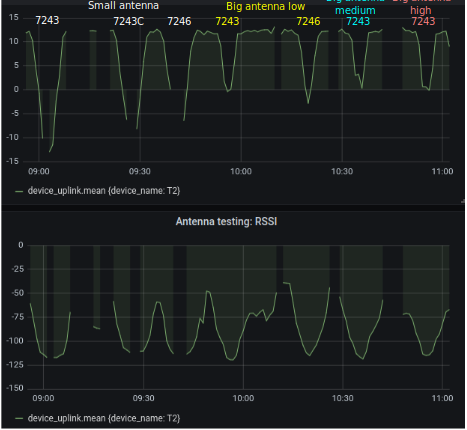

Gateway antenna tests

A test was conducted to compare the three different gateways and two different antennas. The three gateways were the following:
   - RAK Wireless LoRa Raspberry Pi 3 B+ Gateway  RAK7243
   - RAK Wireless LoRa Raspberry Pi 3 B+ Gateway  RAK7243C
   - RAK Wireless LoRa Raspberry Pi Zero RAK7246 

Each of these gateways comes with a basic LoRa ½ wave whip antenna with 2 dB gain and that was compared to a LoRa Fiberglass Antenna Type N 5.8dB gain available from Sparkfun. 

Each test used a tracker sending coordinates to the single gateway every 5 seconds. For each test the tracker was walked along a road in the forest until it was about 440m from the gateway and then it was walked back. For two of the tests there was an slight interruption so the return trip but the time for each trip was roughly the same. 

The following configurations were tested:
   - RAK7243 with stock antenna sitting on deck railing
   - RAK7243C with stock antenna sitting on deck railing
   - RAK7246 with stock antenna sitting on deck railing 
   - RAK7243 with fiberglass antenna at same height as stock antenna tests
   - RAK7246 with fiberglass antenna at same height as stock antenna tests
   - RAK7243 with fiberglass antenna one meter higher than stock antenna tests
   - RAK7243 with fiberglass antenna three meters higher than stock antenna tests

The image below shows the signal to noise ratio (SNR) and Received Signal Strength Indicator (RSSI) for each test. You can see the signal gets weaker (the valley in the curves) and when using the stock antennas there are data gaps when the distance between the tracker and gateway were the greatest. Using the fiberglass antenna improved signal strength significantly and the height of the antenna had slight improvements with the signal strength.  

It was good to see that the RAK7246 gateway (Raspberry Pi Zero version) performed only slightly worse (evidenced by the larger gap when the tracker was furthest from the gateway) when compared to the larger Raspberry Pi 3 B+ RAK7243 and RAK7243C. 

It should be noted that the path that was being walked was slightly inclined uphill and that may account for the lack of significant signal strength improvement when the antenna was raised. Typically the higher the antenna the better the long range signal strength. 

