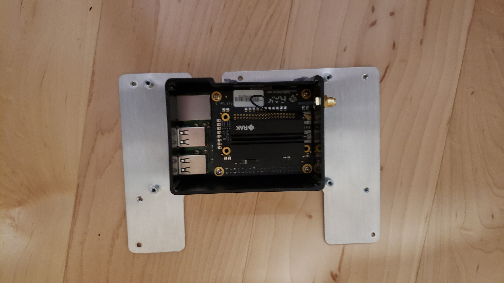
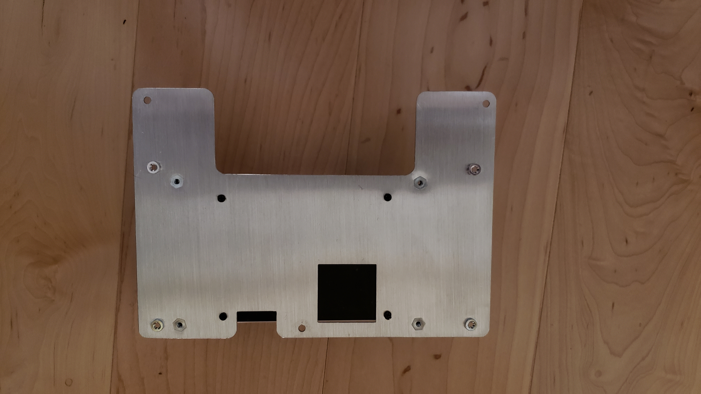
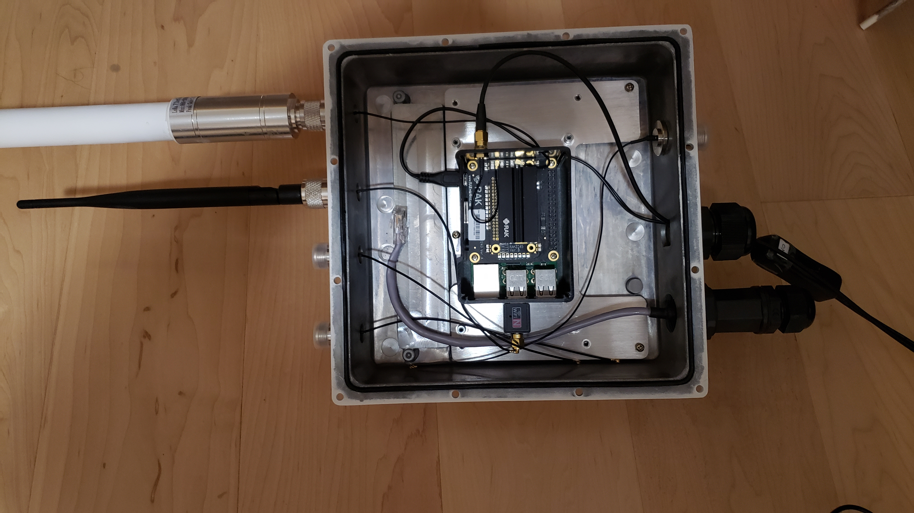
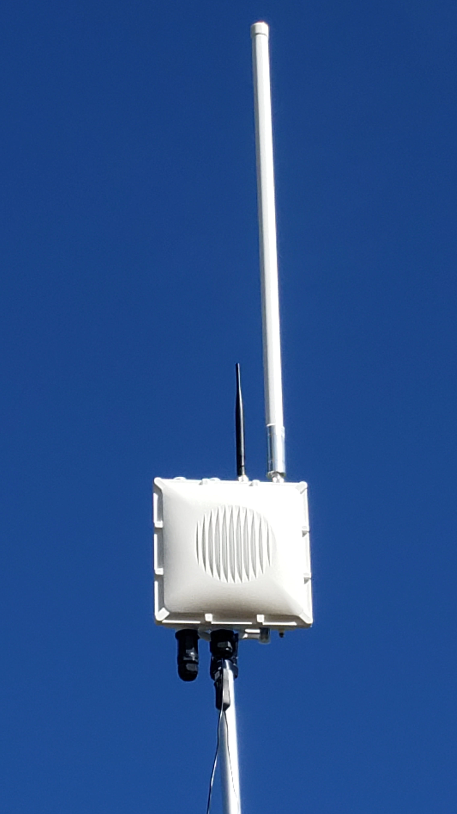

Raspberry Pi gateways

We decided to use Raspberry Pi (RPi) gateways since they are fairly easy to work with and we were already familiar with how they work and the cost was very reasonable. Using the RPi gateways made it easy to experiment with different LoRaWAN configurations including installing all of the ChirpStack components on the gateway. 

The three RPi gateway we are experimenting with are:
RAK Wireless LoRa Raspberry Pi 3 B+ Gateway RAK7243  $199
RAK Wireless LoRa Raspberry Pi 3 B+ Gateway RAK7243C $278 (internal cellular modem)
RAK Wireless LoRa Raspberry Pi Zero Gateway  $99

RAK Wireless LoRa Raspberry Pi Zero Gateway RAK7246  $99 [this model with a GPS is $114]

A useful addition to these gateways is a larger antenna with greater gain. We are using the external fiberglass antenna for the gateway 5.8dBi (860-930MHz) $49.95. This antenna requires an interface cable N to RP-SMA Cable – 1m (<https://www.sparkfun.com/products/14911>) $7.95 to connect it to the RPi gateway. 

One downside with the RPi gateways is that they need to be enclosed properly if they are to be placed outside. It is possible to create your own enclosure using waterproof junction boxes or something similar but RAK Wireless sells an enclosure specifically for this purpose fro $89 (<https://store.rakwireless.com/products/outdoor-gateway-enclosure>). 

To use this enclosure some additional parts should be purchased:
  - For WiFi reception a USB external WiFi antenna [$9.99] for the RPi Gateway (<https://www.ebay.com/itm/123990900283>) is needed to attach to the USB port on the RPi and this WiFi antenna [$4.99] to attached to the gateway enclosure (<https://www.data-alliance.net/antenna-5dbi-2-4ghz-5ghz-options-outdoor-omnidirectional-w-n-male-right-angle/>) . 
  - We also needed a U.FL-Male To RP-SMA-Male Adapter [$4.70] (<https://www.data-alliance.net/u-fl-male-to-rp-sma-male-adapter-u-fl-connector-snaps-for-permanent-fit>/) so the antenna cables that come with the enclosure can be used.
  - The outdoor enclosure is packaged with a cable gland for the power-over-ethernet adapter that comes with the enclosure but it does not have a gland for a power cable if the Pi will be powered using other means. We used this M25 x 1.5 metric thread gland [$4.25] (
	<https://www.ebay.com/itm/352874323191>).

Additional cell modem antennas would need to be purchased if using the cellular modem. 

I attached the GPS antenna using the connector on the RPi. To do that I passed the GPS cable through the same gland the the power cable goes through. Perhaps a better option is to purchase an N male to RP-SMA female connector (<https://www.data-alliance.net/n-male-to-rp-sma-female-adapter-for-antenna-cables/>) so the GPS can be connected to the enclosure. 

Following are some photos of our enclosure. The enclosure comes with an aluminum plate that screws into the enclosure. I had to drill four holes that matched the holes on the bottom of the RPi. 






To make the USB WiFi work you need to turn off the internal RPi WiFi. You can do that by logging into the RPi and typing: sudo iwconfig wlan0 txpower off
To turn it back on after you disconnect the USB WiFi you would type: 



``` bash
sudo rfkill unblock wifi
sudo iwconfig wlan0 txpower on
reboot
```
