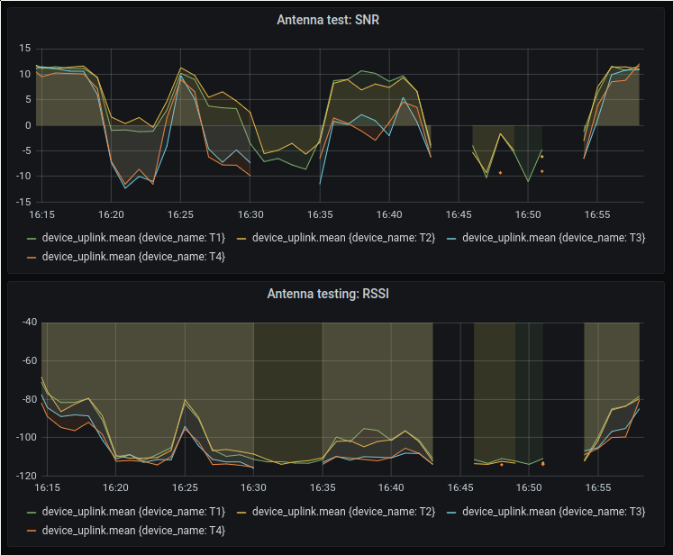

LoRa antenna tests

A test was conducted to compare two different LoRa antennas that are suitable for attaching to the Gnat tracker. We tested the following antennas:
 - T1 & T2 - Aneren 66089-0930 915 MHz whip antenna 
 - T3 & T4 - Molex ISM Band 1.4dBi Gain 870MHz/928MHz Tray

Two of each of the antenna was mounted on a board which was attached to a roof rack on a car. 

The car was driven to different locations within a radius of approximately 550m of the gateway with rests of a few minutes at various spots. 

The image below shows the signal to noise ratio (SNR) and Received Signal Strength Indicator (RSSI) for each test. It is clear that the whip antenna (T1 & T2) perform better than the Molex antenna in this test. It is quite possible that the reason for this difference is that the orientation of the Molex antenna was horizontal and the whip antenna was more or less vertical. This reasoning was not tested since if the Molex antenna was used for animal tracking it would likely be mounted horizontally. 

