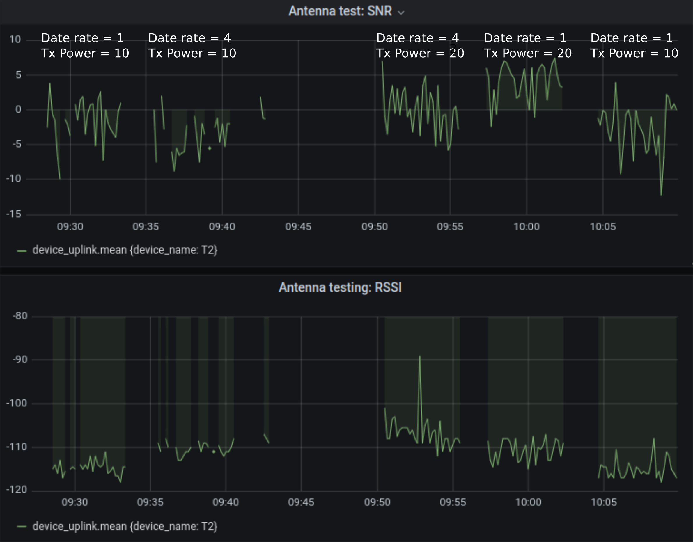

Testing impact of changing data rate and transmission power

On 21 August 2020 a test of different LoRa data rate and transmission power (Tx Power) settings was conducted. The test platform was a turtle tracker composed of a Gnat LoRaWAN tracker with a GNSS and LoRa antenna. An Arduino sketch was used to control LoRa transmissions. Five configurations were tested and for each test coordinate data from a GNSS recover was transmitted every five seconds for 5 minutes. The test environment was in a wooded area with the tracker ~440m from the LoRa gateway.


The following settings were used:

``` C++
Data rate = 1, Tx Power = 10
Data rate = 4, Tx Power = 10
Data rate = 4, Tx Power = 20
Data rate = 1, Tx Power = 20
Data rate = 1, Tx Power = 10  (same as the first test)
```

The range for data rate is from 0 (slowest) to 4 (fastest) in the US but a setting of 0 did not appear to work so a value of 1 was used for the lowest data rate. Tx Power can range from 10dbm to 20dbm for the US.

The image below shows the signal to noise ratio (SNR) and Received Signal Strength Indicator (RSSI) for each test. The results are not all that surprising. The first two tests highlight that there is more data dropout (loss) with the faster data rate (4). It also shows that a higher transmission power setting improves signal strength. 

Since the turtle tracker will be operating in challenging environments we will set the data rate to 1 and Tx Power to 20dbm. 




