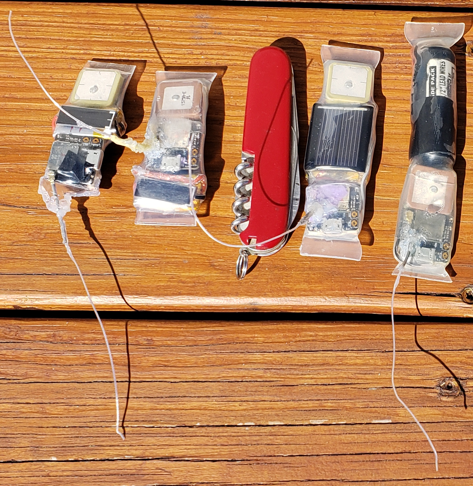

**Enclosures**

The enclose needs to be watertight. Our initial specification is that it should be watertight to a depth of 20m. Ideally it would be nice to be able to reprogram the unit, remove the electronics and change batteries without having to destroy the enclosure although that is not a current constraint. 

To date two different approaches have been tried for enclosures. Both include the electronics and a AA battery and a normally-closed reed switch so a user can turn it off or restart it using a magnet if necessary.

The first enclosure uses a 1/2” Schedule 40 PVC pipe that is drilled to reduce the wall thickness and then molded to fit the electronics and better fit a turtle carapace (shell).

To make this a 4.25” section of pipe is drilled with a 5/8” drill to increase the size of the hole to accommodate a SAFT LS14500 AA 3.6V 2600mAh Li-SOCl2 battery with wire leads. The diameter of the batteries is slightly larger than a typical AA battery due to the wires and a plastic sheath that envelopes the battery and leads. A hole has to be drilled in the PVC pipe near the oval end for the LoRa antenna. To shape the PVC pipe it is submerged in boiling water. After short while (~15 seconds) the PVC becomes malleable and the front 1 3/4” of the pipe is stretched to an oblong shape using a piece of 7/8” x 1/8” steel with a slightly rounded end inserted into the PVC pipe. 

Just prior to deploying the ends of the PVC pipe need to be sealed. I used JB WaterWeld epoxy putty and it seems to work well. A mound of the same epoxy can be mounded up around the antenna to reinforce the antenna while at the same time sealing the hole. 

The result is a watertight enclosure but it is a little heavy weighing 56g and it is difficult inserting the Gnat tracker and GNSS antenna in the flattened end and the battery in the rounder end. 

The second approach used 1” diameter, clear, double-walled 3:1 heat-shrink tubing with adhesive on the inner wall. The cost of the tubing was $4.25/foot. The resulting enclosure has tabs at the ends that could be used to tie onto a carapace or to improve adhesion when attaching to a turtle. This version with a AA battery weighs 35g. 

Before heating the tubing a small hole was made for the LoRa antenna to stick out. I used a small awl but a nail or large needle would work too. I secured the LoRa antenna connector with a narrow piece of 1” lightweight heat-shrink tubing so it wouldn’t disconnect when heating the heavier tubing. Once the tracker components were inserted into the tubing a heat gun was used to shrink the tubing. When one end was close to being shrunk to the extent that seemed appropriate a sheet metal seamer was used to seal the ends of the tube while they were still quite hot. Next the other end of the tube was heated and sealed. The sheet metal seamer formed a good seal on both ends.

Initially the enclosure appeared to be waterproof after dunking it in a bucket of water but after setting outside when we had a few cool nights some condensation formed inside the enclosure. It’s not clear if the seal around the antenna became looser due to thermal expansion/contraction of the plastic or if the seal around the antenna was always susceptible to water vapor leakage. 

To address this issue we are going to apply Loctite 3035 epoxy which is supposed to be great for bonding polyolefin which is likely what the heat-shrink tubing is made of.

Below is an image comparing the different tracker enclosures. The small tracker has a 110 mAh rechargeable battery and you can see how I used electrical tape to bundle the components together before heating the tubing. 

