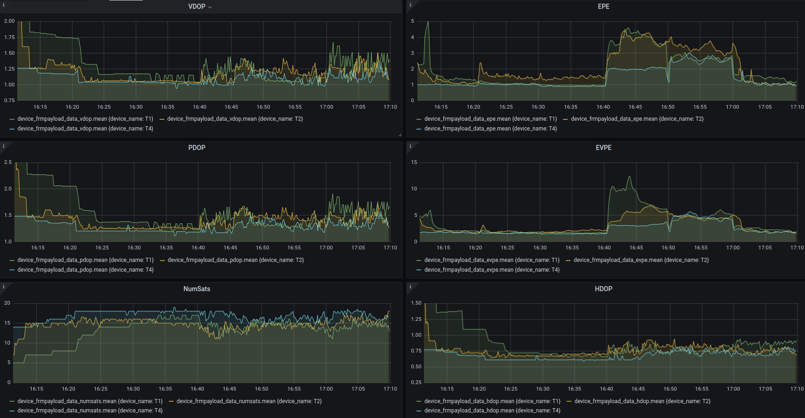

**GNSS antenna tests**
 
Three tests were conducted to compare the performance of different GNSS antennas. The first test used these four antennas:
 - T1 - Inventek Systems ACTPAT184-01-IP (active antenna)
 - T2 - Molex Flexible GNSS Antenna (passive antenna)
 - T3 - Adafruit Passive GPS Antenna uFL - 9mm x 9mm -2dBi gain
 - T4 - Adafruit Passive GPS Antenna uFL - 15mm x 15mm 1 dBi gain

The test involved mounting the 4 GNSS antennas on a Gnat tracker and placing all four trackers on a board. The trackers were spaced ~25” apart. The board with the trackers was placed in the following places for ten minutes:

 - mowed lawn with clear view of the sky
 - dense patch of blooming goldenrod
 - field with waist-high grass
 - under a wooden deck
 - in the woods under dense Gray Dogwood trees
 - mowed lawn with clear view of the sky

The results below indicate the active antenna preformed significantly better than the three passive antennas. The smaller Adafruit GPS antenna did not appear to be functioning.

The second test compared the following two active antennas:
 - T1 - Inventek Systems ACTPAT184-01-IP (same as T1 in the first test) [weight 8.0g]
 - T2 – MikroElektronika MIKROE-3375 [weight 7.6g]

The same protocol and landscapes from the first test were used and the results are displayed in the image below. This test indicates that the MikroElektronika (T2) GNSS antenna performs slightly better than the Inventek antenna especially in the more demanding landscapes. The key to the improved performance is likely linked to be its ability to receive data from more satellites (NumSats) in challenging land cover such as the deck and trees. 

The third test compared the following two active antennas:
 - T1 - Inventek Systems ACTPAT184-01-IP  [weight 8.0g]
 - T2 - MikroElektronika MIKROE-3375   [weight 7.6g]
 - T4 – Data Alliance AGPSLNAem25  [weight 8.1g]

The same protocol and landscapes from the other tests were used and the results are displayed in the image below. This test indicates that the Data Alliance AGPSLNAem25 (T4) GNSS antenna performs slightly better than the other antennas with lower error and acquiring a signal from more satellites. The price of this antenna is also about half the price of the other antennas, $4.75 from Data Alliance.

Some quick tests on current usage were conducted using the Gnat with the GNSS acquiring a fix. These results show the approximate average current use in mA.
 - T1 - Inventek Systems ACTPAT184-01-IP   [43mA]
 - T2 - MikroElektronika MIKROE-3375   [30mA]
 - T4 – Data Alliance AGPSLNAem25  [31mA]
